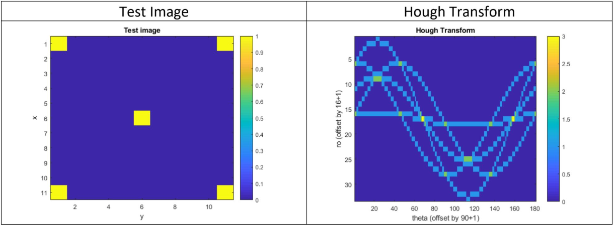

# Hough-Transform

<b>Hough transform</b> is a feature extraction technique that is used in digital image processing. A classical application of the Hough transform is for line detection. In this project, the Hough transform will be used to extract the straight lines in a digital image. And it will be applied onto a street image to detect the lanes.

The Hough transform maps lines to sinusoids in a new parameter space called the Hough space. The interesection of the sinusoids in the Hough space are given weigths that represents a fitted line that crosses the weighted number of discrete image points.

